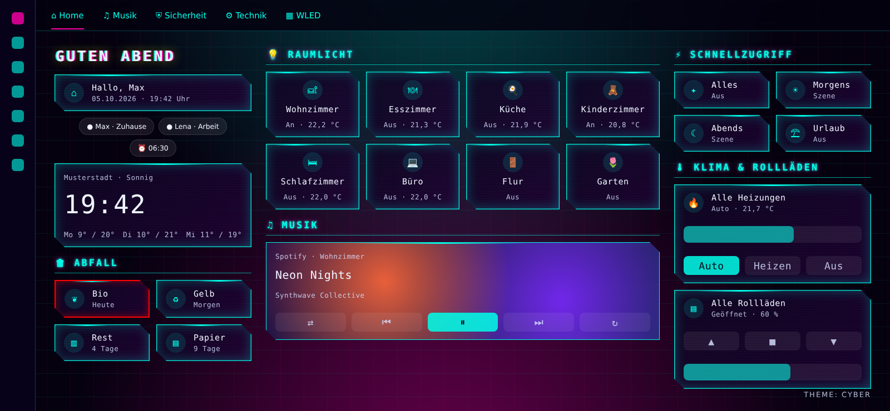
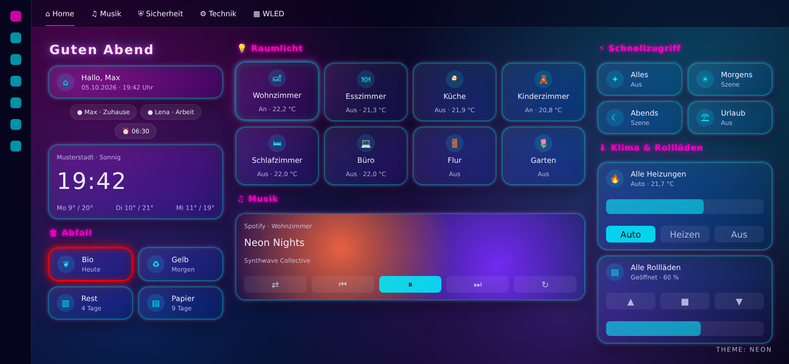

# Cyber & Neon Themes für Home Assistant

Zwei dunkle Designs für Home Assistant Dashboards:

| Design | Look |
|---|---|
| **Cyber** | Cyberpunk-HUD: abgeschrägte Ecken, Scanlines, laufender Scan-Balken, Orbitron-Schrift, Neon-Raster im Hintergrund (Cyan / Pink / Gelb) |
| **Neon** | Glas-Karten mit Unschärfe, Cyan-Rand mit Magenta-Glow, Hover-Effekt, dunkler Farbverlauf im Hintergrund (Cyan / Magenta / Violett) |

Beide Designs stylen alle Karten automatisch – im Dashboard selbst ist kein `card_mod` nötig.

### Cyber



### Neon



*Vorschaubilder sind Mockups mit Beispieldaten.*

## Voraussetzungen

1. **[card-mod](https://github.com/thomasloven/lovelace-card-mod)** (über HACS → Frontend installieren)
2. Für **Cyber**: die Schrift *Orbitron* als Dashboard-Ressource
   *Einstellungen → Dashboards → ⋮ → Ressourcen → Ressource hinzufügen*
   - URL: `https://fonts.googleapis.com/css2?family=Orbitron:wght@400;600;800&family=Share+Tech+Mono&display=swap`
   - Typ: **Stylesheet**
3. In der `configuration.yaml` müssen Designs aus dem Ordner `themes` geladen werden:

```yaml
frontend:
  themes: !include_dir_merge_named themes
```

## Installation über HACS

1. **HACS → ⋮ (oben rechts) → Benutzerdefinierte Repositories**
2. Repository: `https://github.com/Cooper81/cyber-neon-themes` – Typ: **Theme** → Hinzufügen
3. In HACS nach **Cyber & Neon Themes** suchen → **Herunterladen**
4. **Entwicklerwerkzeuge → Aktionen → `frontend.reload_themes`** ausführen (oder Home Assistant neu starten)
5. **Profil → Design** → `Cyber` oder `Neon` wählen

## Manuelle Installation

Die Dateien aus `themes/` in den Ordner `config/themes/` deiner Home-Assistant-Installation kopieren und `frontend.reload_themes` ausführen.

## Anpassen

Die Akzentfarben stehen oben in jeder Datei als RGB-Werte:

```yaml
cyber-accent-rgb: '0, 255, 234'    # Rahmen, Scan-Balken
cyber-accent2-rgb: '255, 0, 170'   # Überschriften-Schatten
cyber-accent3-rgb: '252, 238, 10'  # Seitentitel
```

Einzelne Karten können weiterhin per `card_mod` überschrieben werden – die Designs setzen bewusst kein `!important`.

## Hinweise

- Ein Design gilt pro Gerät/Browser (Profil-Einstellung) oder für einzelne Ansichten über `theme: Cyber` in der Ansicht.
- Ansichten oder Karten mit eigenem festen `theme` bzw. eigenem `card_mod`-Styling werden vom Design nicht verändert.
